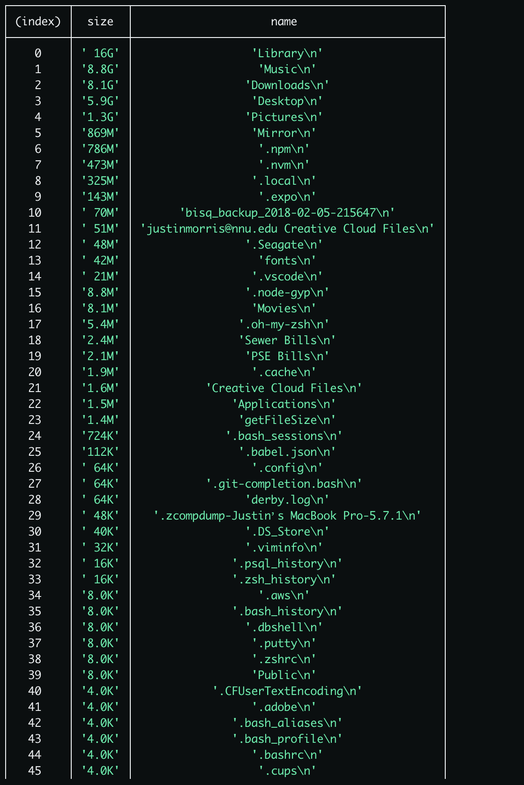
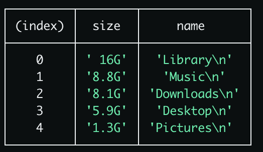

# GetFileSize

A JS script to see who's using your 128Gs. Running out of space too fast.

Get a Human-Readable print out of who's using the most data.

Worried more about the g's? Run the command with a `-g`. 

